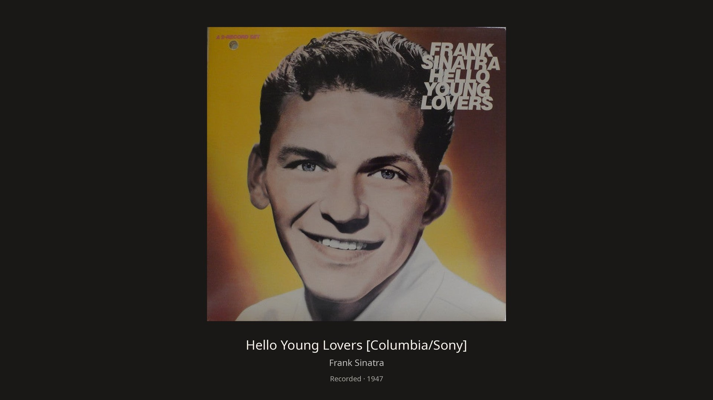
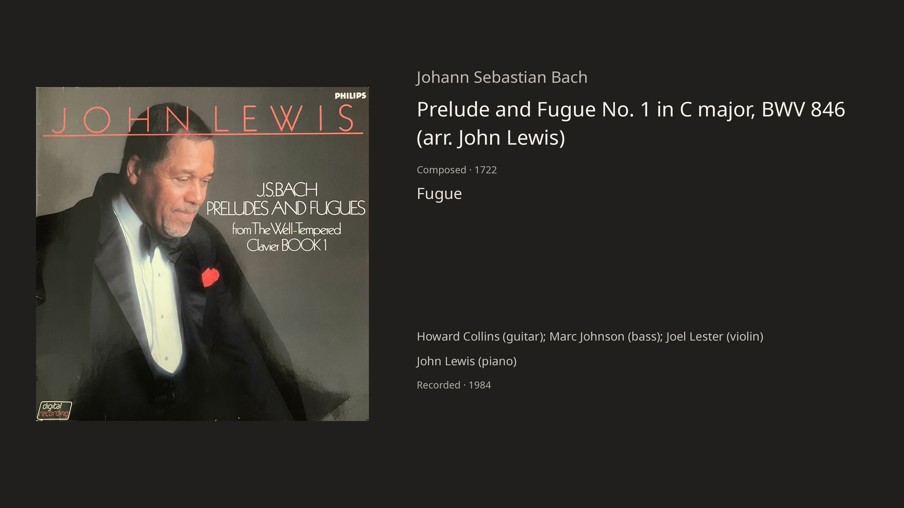
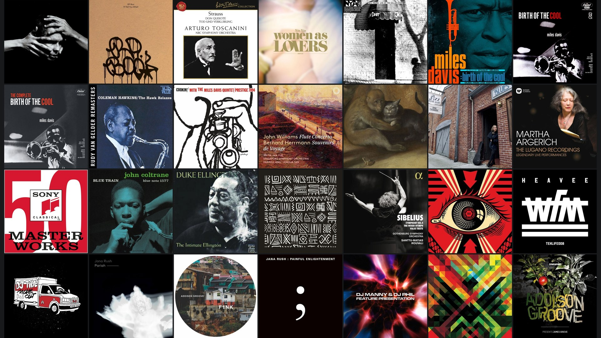

# Listening Room Frame

Display the album you're listening to on a Samsung The Frame TV, with a rotating collage of your 28 most recent albums. The TV stays in Art Mode while audio plays through your existing hi-fi.

A Python service reads playback information from a UPnP renderer, finds artwork, renders a 4K image, and sends it to the Frame's local Art Mode interface. No iPad screen mirroring or TV audio playback is involved.

## On the screen

These are the images rendered by Listening Room Frame for the TV: album artwork, a detailed classical view, and the recent-album collage.

### Now playing



### Classical recordings

Composer, work, movement and performers appear separately, with composition and recording dates clearly distinguished.



### Your recent listening

A rotating collage brings the 28 most recent albums together.



Album artwork remains the property of its respective rights holders and is shown here to illustrate the display.

## Features

- Album cover, artist, title, and recording year where available.
- Classical cards with separate composer, work, movement, conductor, ensemble, soloist, and composition date.
- Explicit labels distinguish recording dates from original-release or release-date fallbacks. Uncertainty qualifiers remain visible.
- Persistent, deduplicated 28-album history. Replaying an album moves it to the front. A 7-by-4 collage appears every two minutes for 15 seconds.
- Local artwork through MinimServer; Qobuz artwork and track details through public album pages.
- Read-only file tags plus a persistent, per-track enrichment store and protected overrides.
- Respects normal TV mode and manual artwork choices. Restores the previous art after two minutes stopped or paused, or on a normal service stop.
- Reuses current/collage images and removes superseded images owned by this application.

## Status and compatibility

This is an early DIY release extracted from a working listening-room installation. It has been used with a Samsung QN65LS03AAFXZA, a CM5 Diretta UPnP renderer, MinimServer, and a Fedora NUC. The public package has automated tests; its generalized configuration has not been tested on another complete installation.

You need Python 3.10+, a compatible Samsung Frame reachable on your local network, and a renderer exposing UPnP AVTransport. Local metadata extraction additionally needs `ffprobe` from FFmpeg and access to the library files. Linux/systemd is the documented deployment target. A NUC is not inherently required, but other hardware and operating systems have not been validated.

Known limitations:

- Device discovery and a setup wizard are not included. TV, renderer and MinimServer endpoints must be configured manually; static DHCP leases are helpful.
- Renderer service paths and metadata vary. The default AVTransport path matches the tested renderer. Use `renderer_control_url` for a different full control URL from the device description.
- MinimServer's `0$items` browse support and file URL mapping are assumed. Set `library_resource_prefix` to the exact URL path prefix preceding library-relative filenames.
- Qobuz integration parses public pages, not an authenticated catalogue API. Markup changes, region restrictions and missing credits can interrupt enrichment. Qobuz recording/composition dates are not comprehensively available.
- Multidisc history grouping depends on consistent album titles and recognizable disc directories; it is not universal release identification.
- Samsung firmware and Art Mode APIs vary. Switching uses the TV's normal image selection; there is no programmed crossfade. The bridge checks Art Mode directly because the TV can report standby while displaying artwork. It does not wake the TV or switch it into Art Mode.
- Missing artwork restores the previous TV art. There is no automatic artist-portrait search.
- Dates and other supplied metadata require source review. A populated field does not prove correctness.

## Install

Install Python and FFmpeg using your operating system's package manager, then:

```sh
git clone https://github.com/kstirman/listening-room-frame.git "$HOME/listening-room-frame"
cd "$HOME/listening-room-frame"
python3 -m venv .venv
.venv/bin/python -m pip install -r requirements.txt
cp config.example.json config.json
```

Edit `config.json`:

- `tv`: Frame hostname or IP. `tv_model`: exact model identifier expected by the safety check.
- `renderer`: renderer HTTP base URL. Optionally set `renderer_control_url`.
- `minim_control`: actual MinimServer ContentDirectory control URL, including its server UUID.
- `local_art_hosts`: allowed local hosts serving playback resources and covers; list hostnames/IPs without schemes or ports.
- `library_root`: filesystem location of your music, as seen by this process.
- `library_resource_prefix`: matching MinimServer resource URL path prefix. The example defaults to `/minimserver/*/AudirvanaLibrary/`.
- Timing/history settings: seconds and number of distinct albums. Keep `history_limit` at 28 for the intended layout.

With music playing and the Frame in Art Mode, run in the foreground:

```sh
.venv/bin/python bridge.py --config config.json --state-dir "$HOME/.local/state/listening-room-frame"
```

Accept the TV's connection prompt if shown. Confirm the correct cover appears. Stop with Ctrl-C and confirm your previous art returns. The service never powers on the TV, switches its input, or controls audio playback.

### Run automatically on Linux

The supplied unit expects the checkout and virtual environment at `~/listening-room-frame`:

```sh
mkdir -p "$HOME/.config/systemd/user"
cp frame-art.service "$HOME/.config/systemd/user/"
systemctl --user daemon-reload
systemctl --user enable --now frame-art.service
journalctl --user -u frame-art.service -n 30
```

For operation without an interactive login, enable user lingering according to your distribution's instructions. Reboot and verify service startup and actual TV behavior on your installation.

Stop with `systemctl --user stop frame-art.service`. Keep the state directory: it contains the original art ID needed for restoration. If the TV was unreachable at shutdown, restore later with:

```sh
.venv/bin/python bridge.py --config config.json --state-dir "$HOME/.local/state/listening-room-frame" --restore
```

## Metadata cleanup tools

These tools support a reviewed cleanup workflow; they do not automatically research and correctly identify every recording.

1. Inventory tags and embedded/folder artwork without changing audio:

```sh
.venv/bin/python library_enrich.py --library-root /path/to/music
```

This writes `inventory.json` and extracted cover copies beneath `/path/to/music/.listening-room-metadata/`. It does not publish covers into MinimServer or change your audio tags. Extracted cover storage is not automatically pruned.

2. Report missing fields, including classical tracks identified through overrides:

```sh
.venv/bin/python metadata_tools.py --library-root /path/to/music audit > metadata-audit.json
```

Missing conductor, ensemble or movement fields may be inapplicable; review the candidates. Composition dates describe the work/version, not the recording session. Identify recording editions before borrowing metadata from another catalogue.

3. Research gaps and write a proposal, with provenance for each field:

```json
{
  "tracks": {
    "Artist/Album/01.flac": {
      "fields": {"recordingDate": "1959", "compositionDate": "c. 1783"},
      "provenance": {
        "recordingDate": "Original booklet, page 4: recording sessions in 1959",
        "compositionDate": "Publisher catalogue URL and version identification"
      }
    }
  }
}
```

4. Apply reviewed additions:

```sh
.venv/bin/python metadata_tools.py --library-root /path/to/music apply proposal.json
```

The tool fills empty fields only, preserves populated enrichment fields and `track-overrides.json`, backs up an existing database, and atomically replaces `enriched.json`. It never edits audio files. Run one metadata writer at a time. Restart the display service after editing metadata to clear its track-detail cache.

Local enrichment applies only to matching local file paths; it does not automatically transfer to Qobuz editions. `recording-dates.json` and `work-dates.json` are empty extension registries. The date tests illustrate their schemas using public music facts.

Making art available to JPLAY is a separate step: install a reviewed cover sidecar using the naming rules for your MinimServer configuration, rescan MinimServer, then refresh JPLAY's library. This public release deliberately excludes the original installation's album-specific publishing scripts.

## Storage and privacy

TV state, authorization token (if issued), current images and recent covers live in the selected state directory. Recent cover history is capped and superseded application-owned TV images are cleaned up. Inventory/extracted covers and metadata backups are separate and are not size-capped.

Keep `config.json`, state, tokens, library inventories, enrichment databases, downloaded artwork/booklets and private research out of Git. The repository contains no music files. README screenshots include album artwork to illustrate the display; operational artwork caches are excluded. Album/track IDs are used for public Qobuz lookups; signed playback URLs are not submitted to Qobuz by this application. The app reads local audio tags, not audio playback data.

## Tests

```sh
.venv/bin/python -m unittest discover -v
```

Tests use fake TV/network objects and temporary metadata fixtures. They cover restoration, manual selections, collage timing and uniqueness, local resource matching, date semantics, and preservation of reviewed metadata. Passing tests do not certify another TV model or firmware.

## Project layout

- `bridge.py`: playback watcher, artwork resolution, TV lifecycle and collage scheduling.
- `layouts.py`: 4K album, classical and collage images.
- `classical.py`, `dates.py`, `library_metadata.py`: metadata interpretation and local enrichment.
- `library_enrich.py`, `metadata_tools.py`: inventory, field audit and reviewed additions.
- `frame-art.service`: optional systemd user service.

Independent community project; not affiliated with Samsung, Qobuz, MinimServer or JPLAY. See `LICENSE` for the application license. Third-party libraries, media and metadata retain their own terms.

### Recovery from stalled TV requests

The Linux service bounds each complete artwork update to 120 seconds, including TV cleanup. A stalled operation logs only stack locations (no source text or local values) and exits unsuccessfully so the supplied service restarts it after 30 seconds. Idle restoration on exit and `--restore` have a 30-second limit. A stop request shortens an active deadline to at most 30 seconds. Standalone runs exit on timeout and need to be started again manually.

This also covers TV event streams that keep a socket active without delivering the requested response. Recovery uses the existing saved artwork state; an upload interrupted before its returned ID is saved may leave an orphan image on the TV. The deadline is a recovery safeguard, not proof of the cause of every display freeze.

Transient update failures retry after five seconds so an old album does not remain displayed for a full minute after a brief connection error. Each retry polls playback again. Error diagnostics identify the operation phase; playback changes log hashed track/album identifiers and transport state, never signed stream URLs or raw metadata. These distinguish changing renderer metadata from a stalled display without exposing source credentials.
